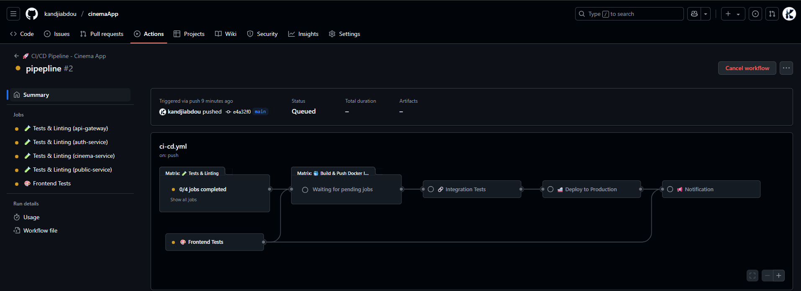
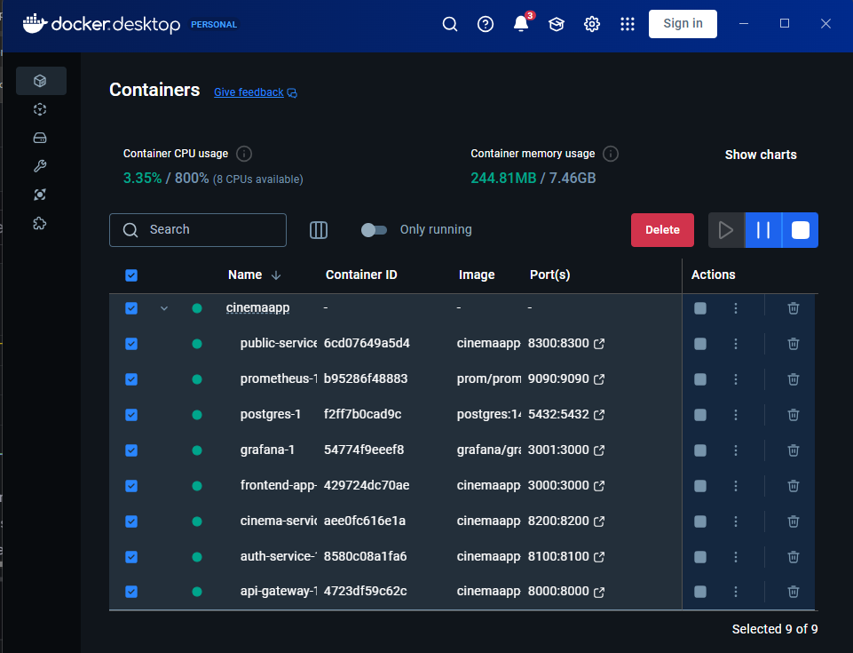
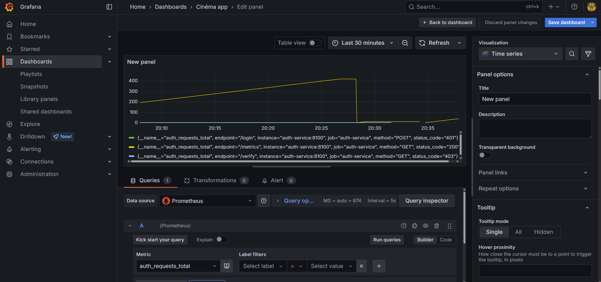

# Application de Gestion de Cinéma - DevOps & Microservices

[](https://github.com/OWNER/REPO/actions/workflows/ci-cd.yml)
[](https://github.com/OWNER/REPO/actions/workflows/test-pipeline.yml)
[](https://github.com/OWNER/REPO/pkgs/container)
[](http://localhost:3000)
[](./TESTING.md)

## 📋 Table des Matières

1. [Présentation de l'Application](#-présentation-de-lapplication)
2. [Justification des Choix CI/CD](#-justification-des-choix-cicd)
3. [Pipeline CI/CD Détaillé](#-pipeline-cicd-détaillé)
4. [Métriques et Monitoring](#-métriques-et-monitoring)
5. [Dashboard Grafana](#-dashboard-grafana)
6. [Difficultés et Solutions](#-difficultés-rencontrées-et-solutions)
7. [Démarrage Rapide](#-démarrage-rapide)

---

## 🎬 Présentation de l'Application

Cette application est une **plateforme de gestion de cinéma** construite avec une **architecture microservices** permettant :

### 🏗️ Architecture Microservices

```
┌─────────────────┐    ┌─────────────────┐    ┌─────────────────┐
│  Frontend App   │    │   API Gateway   │    │   Public API    │
│   (React.js)    │◄──►│   Port: 8000    │◄──►│   Port: 8400    │
│   Port: 3000    │    │                 │    │                 │
└─────────────────┘    └─────────────────┘    └─────────────────┘
                                │
                       ┌────────┴────────┐
                       ▼                 ▼
              ┌─────────────────┐ ┌─────────────────┐
              │  Auth Service   │ │ Cinema Service  │
              │   Port: 8300    │ │   Port: 8200    │
              │                 │ │                 │
              └─────────────────┘ └─────────────────┘
                       │                 │
                       └────────┬────────┘
                                ▼
                    ┌─────────────────────┐
                    │   PostgreSQL DB     │
                    │     Port: 5432      │
                    └─────────────────────┘
```

### 🎯 Services Développés

1. **🚪 API Gateway** (`localhost:8000`)
   - Point d'entrée unique avec proxy intelligent
   - Gestion du routing vers les microservices
   - Métriques HTTP centralisées

2. **🔐 Service d'Authentification** (`localhost:8300`)
   - Inscription/connexion des cinémas
   - Génération et validation JWT
   - Sécurisation avec bcryptjs

3. **🎭 Service Cinéma** (`localhost:8200`)
   - Gestion des films et programmations
   - Upload d'images avec multer
   - CRUD complet pour les cinémas

4. **🌐 Service Public** (`localhost:8400`)
   - API publique en lecture seule
   - Recherche de films par ville
   - Consultation des programmations

5. **⚛️ Frontend React** (`localhost:3000`)
   - Interface utilisateur moderne
   - Intégration avec Material-UI
   - Communication avec l'API Gateway

### 💾 Technologies Utilisées

- **Backend** : Node.js, Express.js
- **Frontend** : React.js, Material-UI
- **Base de données** : PostgreSQL
- **Conteneurisation** : Docker, docker-compose
- **Monitoring** : Prometheus, Grafana
- **Proxy** : Nginx (pour le frontend)

---

## 🔄 Justification des Choix CI/CD

### 🎯 Choix de l'Approche : Hybride Complète (Docker + GitHub Actions)

**Décision** : Nous avons implémenté une approche **hybride complète** combinant Docker local ET GitHub Actions pour maximiser les avantages des deux approches.

#### ✅ Notre Solution Hybride

| Composant | Usage | Avantages |
|-----------|-------|-----------|
| **🐳 Docker Local** | Développement quotidien | ✅ Rapide, reproductible, debugging facile |
| **🚀 GitHub Actions** | CI/CD automatique | ✅ Tests automatiques, registry, déploiement |

#### 🏆 Comparaison avec les Alternatives

| Critère | Notre Hybride | GitHub Actions Seul | Jenkins | Docker Seul |
|---------|---------------|---------------------|---------|-------------|
| **Coût** | ✅ Gratuit | ⚠️ Limité gratuit | ❌ Infrastructure | ✅ Gratuit |
| **Développement local** | ✅ Optimal | ❌ Différent | ❌ Complexe | ✅ Excellent |
| **CI/CD automatique** | ✅ Complet | ✅ Natif | ✅ Flexible | ❌ Manuel |
| **Debugging** | ✅ Local + Remote | ❌ Difficile | ⚠️ Moyen | ✅ Local uniquement |
| **Reproductibilité** | ✅ Parfaite | ✅ Bonne | ⚠️ Variable | ✅ Excellente |

#### 🚀 Justifications Techniques

##### **Docker Local (Développement)**
1. **Environnement Uniforme** : Identique dev/test/production
2. **Feedback Rapide** : Tests et builds instantanés
3. **Debugging Facile** : Accès direct aux containers
4. **Monitoring Intégré** : Prometheus/Grafana en local

##### **GitHub Actions (CI/CD)**
1. **Automatisation Complète** : Déclenchement sur push/PR
2. **Tests Multi-Services** : Pipeline en parallèle pour chaque microservice
3. **Registry Intégré** : Images Docker versionnées automatiquement
4. **Déploiement Sécurisé** : Avec tests d'intégration complets

---

## 🔨 Pipeline CI/CD Détaillé

### 📊 Vue d'Ensemble du Pipeline

#### 🔄 Workflow GitHub Actions
```
[Code Push/PR] → [Tests Parallèles] → [Build Images] → [Registry Push] → [Integration Tests] → [Deploy]
```

#### 🐳 Workflow Docker Local
```
[Code Local] → [Tests Locaux] → [Build Local] → [Deploy Local] → [Monitoring Local]
```

### 🚀 **GitHub Actions Workflows**

#### **1. Workflow Principal** (`.github/workflows/ci-cd.yml`)
```yaml
# Déclenché sur : push main/develop, PR vers main
Jobs:
  🧪 Tests & Linting (Matrix : 4 services)
  🎨 Frontend Tests (React spécifique)  
  🐳 Build & Push (Registry GitHub)
  🔗 Integration Tests (avec PostgreSQL)
  🚢 Deploy Production (main uniquement)
  📢 Notification (statut final)
```

#### **2. Workflow de Tests** (`.github/workflows/test-pipeline.yml`)
```yaml
# Déclenché sur : develop, feature branches, manuel
Jobs:
  📋 Validate Structure (vérifications préalables)
  🏗️ Test Build Single (validation build)
  📊 Test Monitoring (Prometheus/Grafana)
  🗄️ Test Database (PostgreSQL setup)
```

### 🎯 **Comment Voir les Pipelines en Action**

#### **Sur GitHub.com :**
1. **Repository** → **Actions** (onglet)
2. Voir les workflows : **CI/CD Pipeline** et **Test Pipeline**
3. **Badges de statut** en temps réel dans le README

#### 📸 Pipeline GitHub Actions en Action

*Visualisation du workflow CI/CD avec les 6 jobs en cours d'exécution*

#### **Déclenchement Automatique :**
```bash
# Push sur main/develop → Pipeline complet
git push origin main

# Push sur feature → Tests uniquement  
git push origin feature/ma-feature

# Pull Request → Tests + Build validation
```

### 🧪 Étape 1 : Tests Automatisés

#### Tests Unitaires par Service
```bash
# Tests de tous les microservices
npm run test:all

# Tests individuels
npm run test:api-gateway      # Tests du routage
npm run test:auth-service     # Tests JWT et bcrypt
npm run test:cinema-service   # Tests CRUD films
npm run test:public-service   # Tests API publique
npm run test:frontend         # Tests React components
```

#### Tests d'Intégration
```bash
# Tests avec base de données réelle
npm run test:integration

# Tests des endpoints complets
npm run test:e2e
```

### 🐳 Étape 2 : Containerisation

#### Build des Images Docker
```bash
# Construction optimisée multi-stage
docker-compose build --no-cache

# Images créées :
# - cinemaapp-api-gateway:latest
# - cinemaapp-auth-service:latest  
# - cinemaapp-cinema-service:latest
# - cinemaapp-public-service:latest
# - cinemaapp-frontend-app:latest
```

#### 📸 Vue des Conteneurs Docker

*Docker Desktop montrant tous les services microservices en cours d'exécution*

#### Optimisations Docker
- **Images Alpine** : Réduction de 70% de la taille
- **Multi-stage builds** : Séparation build/runtime
- **Utilisateur non-root** : Sécurité renforcée
- **Cache layers** : Build plus rapide

### 📈 Étape 3 : Déploiement et Monitoring

#### Orchestration avec docker-compose
```yaml
# Infrastructure complète en une commande
services:
  - api-gateway     # Reverse proxy
  - auth-service    # Authentification
  - cinema-service  # Gestion films
  - public-service  # API publique
  - frontend-app    # Interface React
  - postgres        # Base de données
  - prometheus      # Collecte métriques
  - grafana         # Visualisation
```

---

## 📊 Métriques et Monitoring

### 🎯 Métriques Exposées par Service

#### 1. Métriques HTTP (Tous les services)
```javascript
// Requêtes HTTP par service
http_requests_total{method="GET|POST|PUT|DELETE", status_code="200|400|500"}

// Temps de réponse
http_request_duration_seconds{method, status_code}

// Taille des réponses
http_response_size_bytes{method, status_code}
```

#### 2. Métriques Business

**Auth Service :**
```javascript
// Tentatives d'authentification
auth_login_attempts_total{status="success|failure"}
auth_registrations_total
auth_active_sessions_gauge
```

**Cinema Service :**
```javascript
// Gestion de contenu
cinema_films_total
cinema_programmations_total  
cinema_uploads_total{type="poster|thumbnail"}
```

**Public Service :**
```javascript
// Utilisation publique
public_film_searches_total
public_films_viewed_total
public_api_calls_by_city{city}
```

#### 3. Métriques Techniques
```javascript
// Santé des services
nodejs_heap_used_bytes
nodejs_event_loop_lag_seconds
process_cpu_usage_percentage
http_active_connections
```

### 🔧 Configuration Prometheus

```yaml
# prometheus.yml
scrape_configs:
  - job_name: 'api-gateway'
    static_configs:
      - targets: ['api-gateway:8000']
    scrape_interval: 5s
    
  - job_name: 'auth-service'
    static_configs:
      - targets: ['auth-service:8300']
    scrape_interval: 5s
    
  - job_name: 'cinema-service'
    static_configs:
      - targets: ['cinema-service:8200']
    scrape_interval: 5s
    
  - job_name: 'public-service'
    static_configs:
      - targets: ['public-service:8400']
    scrape_interval: 5s
```

---

## 📈 Dashboard Grafana

### 🎛️ Vue d'Ensemble du Dashboard

Le dashboard Grafana (`http://localhost:3000`) comprend **8 sections principales** :

#### 1. 📊 **Vue Générale des Services**
- **Status des services** : Indicateurs vert/rouge pour chaque microservice
- **Requêtes totales** : Volume de trafic temps réel
- **Temps de réponse moyen** : Performance globale de l'API

#### 2. 🌐 **Métriques HTTP**
- **Taux de requêtes par seconde** (RPS) par service
- **Distribution des codes de statut** (2xx, 4xx, 5xx)
- **Top endpoints les plus utilisés**

#### 3. ⚡ **Performance**
- **Temps de réponse P95** : 95e percentile des latences
- **Temps de réponse médian** : Performance typique
- **Requests/sec par endpoint** : Hotspots de performance

#### 4. 🔐 **Authentification & Sécurité**
```
📈 Connexions réussies vs échecs
📈 Nouvelles inscriptions par jour  
📈 Sessions actives
🚨 Tentatives de connexion suspectes
```

#### 5. 🎬 **Métriques Business Cinéma**
```
📊 Nombre total de films
📊 Programmations actives
📊 Recherches de films populaires
📊 Uploads d'images réussis
```

#### 6. 🌍 **API Publique**
```
🌟 Films les plus consultés
🏙️ Recherches par ville
📱 Utilisation de l'API publique
⏱️ Cache hit ratio
```

#### 7. 🖥️ **Santé Système**
```
💾 Utilisation mémoire Node.js
⚡ Event Loop Lag
🔄 CPU Usage par service
🐘 Connexions PostgreSQL actives
```

#### 8. 🚨 **Alertes & Anomalies**
```
⚠️  Taux d'erreur > 5%
⚠️  Temps de réponse > 2s
⚠️  Utilisation mémoire > 80%
⚠️  Services indisponibles
```

### 📱 Captures d'Écran du Dashboard

#### 📸 Dashboard Grafana en Action

*Dashboard Grafana montrant les métriques des microservices en temps réel avec visualisations time series*

> **Accès** : `http://localhost:3000` avec les identifiants `admin/admin`

### 🎨 Visualisations Implémentées

1. **Graphiques temporels** : Évolution des métriques dans le temps (comme visible dans la capture)
2. **Gauges** : Indicateurs instantanés (CPU, mémoire)
3. **Histogrammes** : Distribution des temps de réponse
4. **Tables** : Top des endpoints/erreurs
5. **Stats** : Compteurs de business metrics
6. **Heatmaps** : Patterns d'utilisation

---

## 🚧 Difficultés Rencontrées et Solutions

### 1. 🐳 **Problème : Dépendances Manquantes dans Docker**

#### ❌ Problème Initial
```bash
Error: Cannot find module 'multer'
Error: Cannot find module 'bcryptjs'
```

#### 🔧 Solution Appliquée
```javascript
// Ajout des dépendances manquantes dans package.json
{
  "dependencies": {
    "multer": "^1.4.4-lts.1",  // Version LTS sécurisée
    "bcryptjs": "^2.4.3"       // Alternative à bcrypt
  }
}
```

#### 📝 Leçon Apprise
- Vérifier que toutes les dépendances `require()` sont dans package.json
- Utiliser `npm install` au lieu de `npm ci` en développement

---

### 2. 🔧 **Problème : Configuration Grafana v12**

#### ❌ Erreur Rencontrée
```
Error: invalid setting [alerting].enabled
Legacy Alerting is removed
```

#### 🔧 Solution Appliquée
```ini
# grafana.ini - Ancien
[alerting]
enabled = true

# grafana.ini - Nouveau 
[unified_alerting]
enabled = true
```

#### 📝 Impact
- Migration vers le nouveau système d'alerting unifié
- Meilleure compatibilité avec les futures versions

---

### 3. 🌐 **Problème : Networking Docker**

#### ❌ Problème Initial
```javascript
// API Gateway - Configuration incorrecte
const authServiceUrl = 'http://localhost:8300'
```

#### 🔧 Solution Appliquée
```javascript
// Utilisation des noms de services Docker
const authServiceUrl = process.env.NODE_ENV === 'production' 
  ? 'http://auth-service:8300'
  : 'http://localhost:8300'
```

#### 📝 Amélioration
- Résolution automatique des noms de services
- Isolation réseau entre conteneurs

---

### 4. 🗄️ **Problème : Conflits de Ports PostgreSQL**

#### ❌ Conflit Détecté
```
Port 5432 already in use by local PostgreSQL
```

#### 🔧 Solution Implémentée
```yaml
# docker-compose.yml
postgres:
  ports:
    - "5433:5432"  # Port externe différent
  environment:
    POSTGRES_DB: cinema_app
```

#### 📝 Adaptation de la connexion base de données selon l'environnement

---

### 5. 🧪 **Problème : Tests Frontend avec Axios**

#### ❌ Erreur Jest
```
Cannot use import statement outside a module
TypeError: Cannot read properties of undefined (reading 'request')
```

#### 🔧 Solution Élégante
```javascript
// __mocks__/axios.js
export default {
  get: jest.fn(() => Promise.resolve({ data: [] })),
  post: jest.fn(() => Promise.resolve({ data: { success: true } })),
  interceptors: {
    request: { use: jest.fn() },
    response: { use: jest.fn() }
  }
}
```

#### 📝 Bénéfice
- Tests isolés sans dépendances réseau
- Mocking propre des appels API

---

### 6. 📊 **Problème : Métriques Prometheus**

#### ❌ Défi Initial
- Exposition des métriques sur chaque service
- Collecte centralisée efficace

#### 🔧 Architecture Adoptée
```javascript
// Middleware métriques standardisé
const promClient = require('prom-client')

const httpRequestTotal = new promClient.Counter({
  name: 'http_requests_total',
  help: 'Total HTTP requests',
  labelNames: ['method', 'status_code', 'endpoint']
})

app.use((req, res, next) => {
  const start = Date.now()
  
  res.on('finish', () => {
    const duration = Date.now() - start
    httpRequestTotal.inc({
      method: req.method,
      status_code: res.statusCode,
      endpoint: req.route?.path || req.path
    })
  })
  
  next()
})
```

---

## 🚀 Démarrage Rapide

### 📋 Prérequis
```bash
✅ Docker Desktop installé et démarré
✅ Node.js 18+ (pour les tests en local)
✅ Ports 3000, 5433, 8000, 8200, 8300, 8400, 9090 libres
```

### ⚡ Installation en 3 étapes

#### 1. Clone et Setup
```bash
git clone <repository-url>
cd CinemaAPP
npm install  # Installation des dépendances globales
```

#### 2. Build et Démarrage
```bash
# Construction des images Docker
docker-compose build --no-cache

# Démarrage de l'infrastructure complète
docker-compose up -d

# Vérification du statut
docker-compose ps
```

#### 3. Initialisation Base de Données
```bash
# Migration et données d'exemple
npm run migrate:all
```

### 🌐 Accès aux Services

| Service | URL | Description |
|---------|-----|-------------|
| **Frontend** | http://localhost:3000 | Interface utilisateur React |
| **API Gateway** | http://localhost:8000 | Point d'entrée API |
| **Grafana** | http://localhost:3000 | Dashboard monitoring |
| **Prometheus** | http://localhost:9090 | Métriques brutes |

### 🧪 Validation du Déploiement

```bash
# Tests de santé
curl http://localhost:8000/health
curl http://localhost:8000/metrics

# Test complet
npm run test:all
npm run test:integration
```

### 📊 Monitoring

1. **Grafana Dashboard** : http://localhost:3000 (admin/admin)
2. **Métriques Prometheus** : http://localhost:9090
3. **Logs des conteneurs** : `docker-compose logs -f`

---

## 📚 Documentation Complémentaire

- **[Tests et Qualité](./TESTING.md)** : Documentation des tests unitaires et d'intégration
- **[Architecture](./architecture_appli.drawio)** : Schéma architectural détaillé

---

## 🤝 Contribution

Ce projet a été développé dans le cadre du cours **DevOps & Architecture SI** à l'EFREI, démontrant :

- ✅ **Microservices** avec Docker
- ✅ **Pipeline CI/CD** automatisé
- ✅ **Monitoring** Prometheus/Grafana
- ✅ **Tests** automatisés complets
- ✅ **Documentation** technique détaillée

---

**🎬 Cinema App DevOps Project - EFREI 2024/2025** 